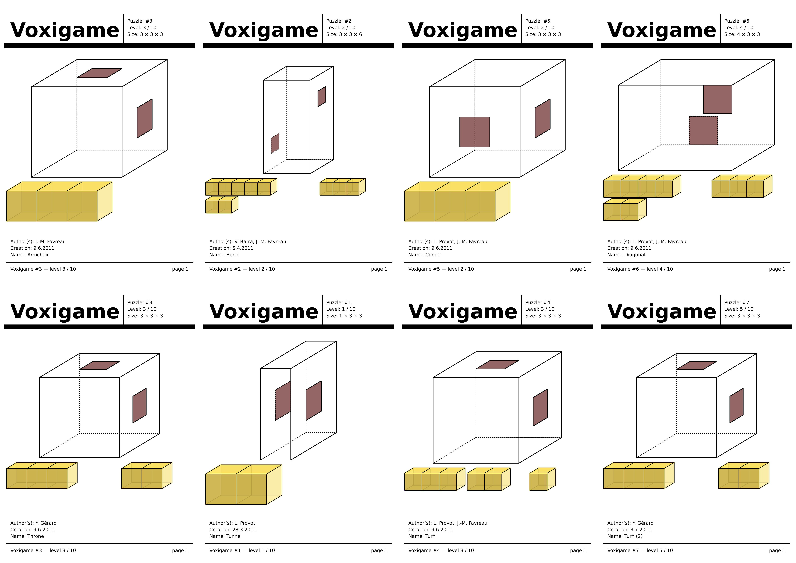
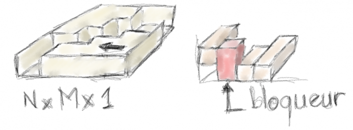

# Conception d'espaces de jeu

Les [règles du jeu Voxigame](./regles-fr.md) donnent les règles générales, mais ne donnent pas de configurations possibles.
En 2011, nous avons exploré la question, en nous demandant d'abord comment aborder la question. 

On s'est demandé si pour toute configuration de plateau (taille de la boîte et position des fenêtres) était *réalisable*, c'est-à-dire s'il existait un ensemble de briques satisfaisant les contraintes du jeu.

## Motifs élémentaires

Nous avons pour cela commencé à identifier différents motifs de taille 3×3×3 ou plus petits, que nous avons appelé *motifs* (ou *patterns*), et qui assemblés permettraient de répondre à la première question de manière constructive (en fabriquant une solution à partir de ces motifs).

Ces motifs élémentaires ont été présentés de manière détaillée sous forme de [manuels pdf](https://github.com/jmtrivial/voxigame/releases/tag/first-export), grâce à ```vg2manual```, et l'image ci-dessous en présente les premières pages.



## Espace des possibles

Il reste certainement beaucoup de configurations à explorer pour pouvoir donner l'ensemble des contraintes permettant d'affirmer qu'une configuration de plateau est réalisable, ou non.

Par exemple, on peut facilement affirmer que si le plateau fait 1 cube de hauteur, et que les fenêtres sont sur des parois latérales, alors il n'y a pas de configuration stable. On s'en convaint facilement en constatant que les briques formeront alors un ensemble de deux composantes connexes distinctes, que rien ne maintiendrait à distance, comme l'illustre l'image ci-dessous (partie gauche). L'ajout d'un niveau supplémentaire en hauteur permettrait d'introduire un élément bloqueur (partie droite de l'image). 



