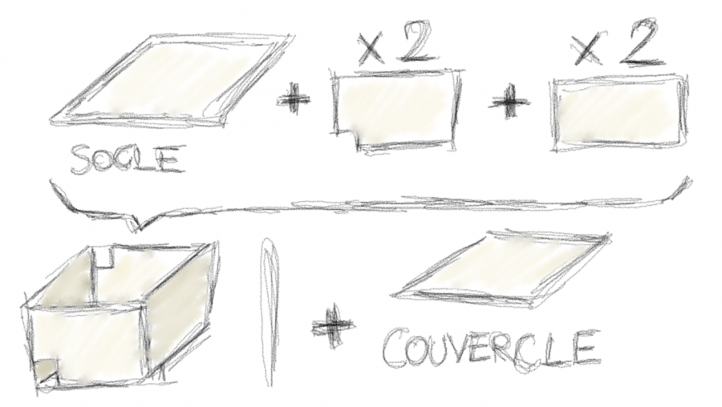
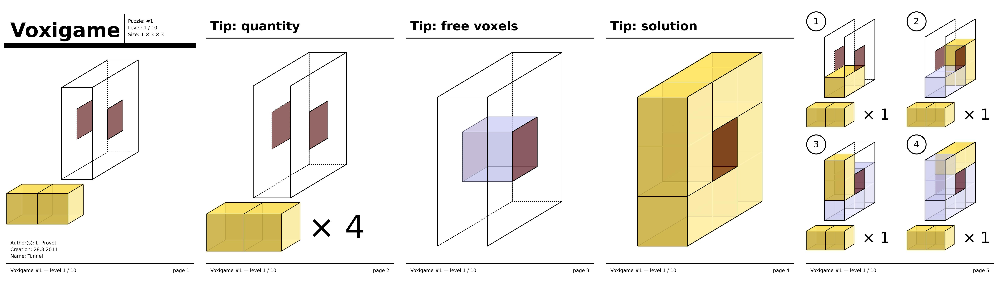
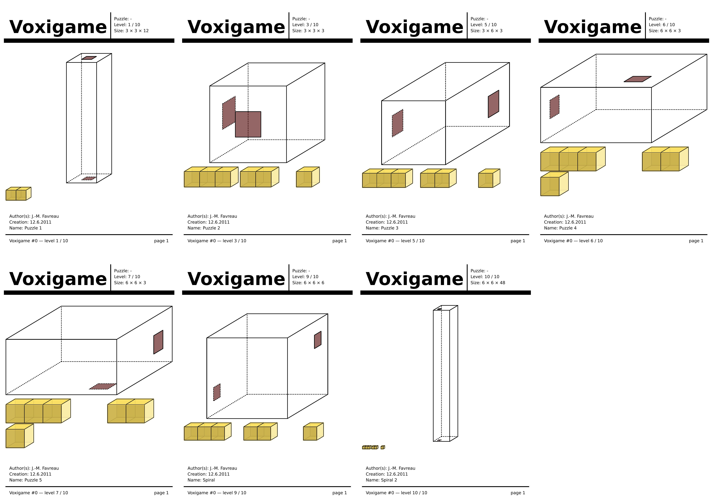

# Règles du jeu Voxigame

Le jeu ou casse-tête *Voxigame* prend place dans un espace de jeu constitué d'une grille régulière à trois dimensions de taille *M × N × O*.

## Espace de jeu 

Il peut être matérialisé par une boîte parallélépipédique fermée par un couvercle, dont l'intérieur est de taille *M* cm par *N* cm pour la base, et de hauteur *O* cm. Deux faces sont percées d'une *fenêtre de passage*, un trou carré de 1 cm de côté, ces trous étant alignés sur la grille virtuelle que constitue l'intérieur de la boîte.

Le joueur dispose également d'un ensemble de parallélépipèdes de section de 1 cm et d'une longueur multiple de 1 cm, appelés *briques*, d'un cordon et d'une bille de diamètre légèrement inférieur à 1 cm. 


## Variation

Les 4 paroies latérales de l'espace de jeu peuvent être déboîtées, et ajustées afin de modifier la position des fenêtres ainsi que la taille de l'espace de jeu.



## Règles du jeu

### Le jeu principal
L'objectif du jeu est de placer les briques à l'intérieur de la boîte, tout en réservant au cordon un chemin reliant les deux fenêtres de passage.

Une fois la boîte refermée, aucune brique ne dois pouvoir se déplacer. On dit alors que la configuration est *stable*.

### Le petit jeu bonus

Une fois fermée la boîte, on peut retirer le cordon, et Voxigame devient un nouveau jeu, pour les plus petits: on fait entrer la bille par l'une des fenêtres, et il s'agit ensuite de faire tourner la boîte jusqu'à ce que la bille sorte de l'autre côté.

## Manuels générés par le logiciel

Le logiciel [vg2manual](../src/tools/vg2manual.cxx) permet de générer des manuels à partir de fichiers xml décrivant une configuration de jeu. Le ```pdf``` ainsi généré contient un ensemble de pages, qui peuvent être consultées toutes ou en partie, suivant le niveau de difficulté que l'on souhaite s'imposer pour résoudre le casse-tête:

* la première présente l'espace de jeu incluant la position des fenêtre ainsi que les types de briques autorisées
* la deuxième reprend les informations de la première, en indiquant pour chaque type de brique le nombre nécessaire pour réussir le casse-tête
* la troisième complète l'information avec le tracé du passage qui devra laisser passer le cordon
* la quatrième présente la solution en transparence
* les pages suivantes proposent un guide étape par étape pour fabriquer la solution

L'image ci-dessous présente chacune des pages d'un exemple simple.




Quelques [manuels d'exemples plus ou moins complexes](https://github.com/jmtrivial/voxigame/releases/tag/second-export)
sont disponibles en pdf, et proposent les cas présentés dans l'image ci-dessous.



## Voir aussi

* réflexions sur la [conception d'espaces de jeu](./conception-fr.md)
