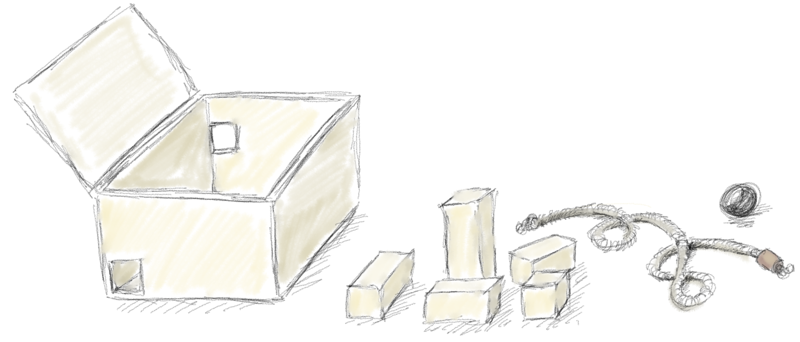

# Règles du jeu Voxigame

Le jeu ou casse-tête *Voxigame* prend place dans un espace de jeu constitué d'une grille régulière à trois dimensions de taille *M × N × O*.

## Espace de jeu 

Il peut être matérialisé par une boîte parallélépipédique fermée par un couvercle, dont l'intérieur est de taille *M* cm par *N* cm pour la base, et de hauteur *O* cm. Deux faces sont percées d'un trou carré de 1 cm de côté, ces trous étant alignés sur la grille virtuelle que constitue l'intérieur de la boîte.

Le joueur dispose également d'un ensemble de parallélépipèdes de section de 1 cm et d'une longueur multiple de 1 cm, appelés briques, d'un cordon et d'une bille de diamètre légèrement inférieur à 1 cm. 

## Variation

Les 4 paroies latérales de l'espace de jeu peuvent être déboîtées, et ajustées afin de modifier la position des fenêtres ainsi que la taille de l'espace de jeu.

